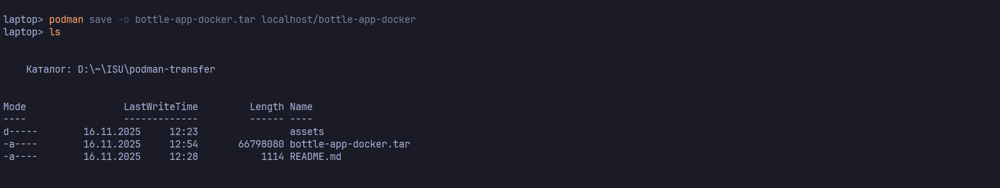
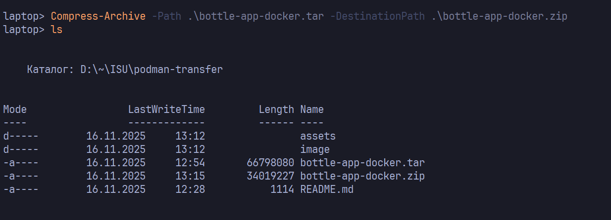
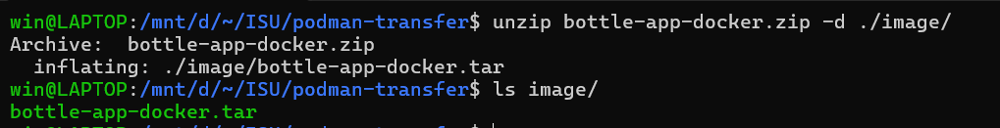
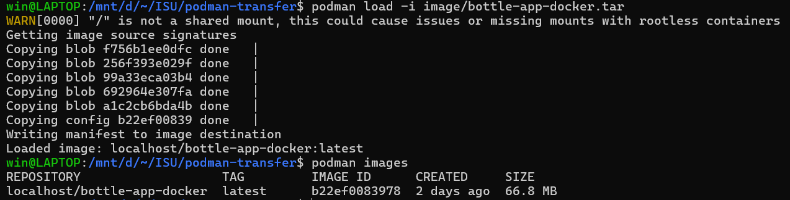
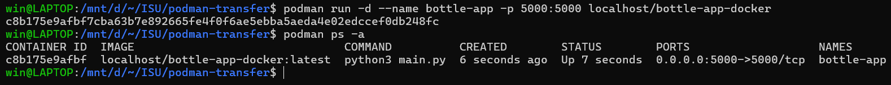

## Перенос контейнера на другой компьютер

Рассматриваемый образ: [Практикум Docker - создание веб-приложения в контейнере](https://github.com/groknut/bottle-app-docker)

Как известно, нередко программное обеспечение распространяется в виде образов Docker. 

Мы выполним перенос образа с одной системы на другой компьютер. Для этого выполните следующие действия

### Получите образ из контейнера (commit)

### Выгрузите образ в файл (save)

### Заархивируйте файл любимым архиватором и передайте файл на другой компьютер

### Извлеките файл с образом из архива

### Загрузите образ в Podman (load)

### Запустите контейнер на основе полученного образа

